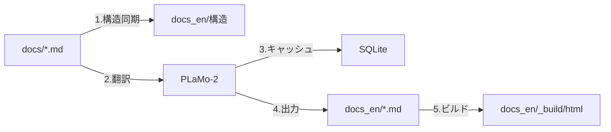

# [Both] MDファイルベース・ドキュメント国際化システム実装計画

## メタデータ
- **作成日**: 2025-01-28
- **言語**: Both (Python中心、ドキュメント構築)
- **ステータス**: DRAFT
- **推定規模**: 大
- **推定コード行数**: 800-1000行
- **対象モジュール**: translations/, docs/, docs_en/

## ⚠️ 技術的負債ゼロの原則

**重要**: このプロジェクトでは技術的負債を一切作らないことを最優先とします。

### 禁止事項（アンチパターン）
❌ **POファイルとMDファイルの混在管理**
```python
# 絶対にダメな例
def translate():
    # sphinx-intl POファイルも残しつつ
    # MDファイルも別途管理... → 二重管理は負債
    pass
```

❌ **段階的移行アプローチ**
```python
# 絶対にダメな例
# Phase 1: とりあえずindex.mdだけ翻訳
# Phase 2: 後でAPIドキュメントも... → TODO残しは負債
```

✅ **正しいアプローチ：最初から完全実装**
```python
# 完全自動化された翻訳システム
def translate_documentation():
    """全MDファイルを一括で構造保持翻訳."""
    sync_structure()  # 完全な構造同期
    translate_all()   # 全ファイル翻訳
    validate_all()    # 品質検証
```

## タスク規模判定

### 判定基準
- [x] 推定コード行数: 800-1000行
- [x] 新規ファイル数: 5-10個
- [x] 影響範囲: 全ドキュメントシステム
- [ ] Rust連携: 不要
- [x] NumPy/Pandas使用: なし（Pathlib, sqlite3使用）
- [x] 非同期処理: 考慮（将来の並列翻訳）

### 規模判定結果
**大規模タスク** - ドキュメント全体の国際化システム構築

## 1. 背景と目的

### 現状の課題
- sphinx-intl/gettextのPOファイル翻訳は文脈を失い品質が低下
- POファイルの管理が複雑（msgid/msgstrの対応、分割された段落）
- PLaMo-2での翻訳効率が悪い（1メッセージずつ処理）

### 提案する解決策
**MDファイル直接翻訳アプローチ**
- 構造を保持したまま.mdファイル全体を翻訳
- 各言語版を独立したディレクトリで管理（docs/, docs_en/）
- PLaMo-2の文脈理解を最大活用

## 2. アーキテクチャ設計

### ディレクトリ構造
```
quantforge/
├── docs/                    # 日本語版（マスター）
│   ├── conf.py             # language='ja'
│   ├── index.md
│   ├── api/
│   ├── models/
│   └── _build/html/        # 日本語HTML
│
├── docs_en/                # 英語版（翻訳後）
│   ├── conf.py            # language='en'（自動生成）
│   ├── index.md           # 翻訳されたMD
│   ├── api/               
│   ├── models/            
│   └── _build/html/       # 英語HTML
│
└── translations/
    ├── translate_docs.py    # 統合翻訳スクリプト（新規）
    ├── sync_structure.py    # ディレクトリ同期（新規）
    ├── validate_translation.py  # 品質検証（新規）
    ├── glossary.py         # 用語集（既存・拡張）
    └── cache/
        └── translation_cache.db
```

### データフロー


## 3. 実装詳細

### Phase 1: 構造同期システム（sync_structure.py）

```python
from pathlib import Path
import shutil
import re
from typing import List, Dict

class DocumentStructureSync:
    """ドキュメント構造の同期管理."""
    
    def __init__(self, source: Path, target: Path):
        self.source = source  # docs/
        self.target = target  # docs_en/
    
    def sync(self):
        """完全な構造同期."""
        # 1. ディレクトリ構造のミラーリング
        self._mirror_directories()
        
        # 2. 設定ファイルのコピーと調整
        self._sync_config()
        
        # 3. 静的ファイルのコピー
        self._sync_static()
        
        # 4. 同期レポート生成
        self._generate_report()
    
    def _mirror_directories(self):
        """ディレクトリ構造を複製."""
        for src_dir in self.source.rglob("*/"):
            if "_build" in str(src_dir):
                continue
            target_dir = self.target / src_dir.relative_to(self.source)
            target_dir.mkdir(parents=True, exist_ok=True)
    
    def _sync_config(self):
        """conf.pyの言語設定を自動調整."""
        src_conf = self.source / "conf.py"
        tgt_conf = self.target / "conf.py"
        
        content = src_conf.read_text(encoding="utf-8")
        # language設定を英語に変更
        content = re.sub(
            r'language\s*=\s*["\']ja["\']',
            'language = "en"',
            content
        )
        tgt_conf.write_text(content, encoding="utf-8")
```

### Phase 2: 翻訳エンジン（translate_docs.py）

```python
import sqlite3
from pathlib import Path
from typing import Optional, Tuple, List
import json
import re

class DocumentTranslator:
    """MDファイル構造保持翻訳エンジン."""
    
    def __init__(self):
        self.cache_db = Path("translations/cache/translation_cache.db")
        self.glossary = FinancialGlossary.TERMS
        self._init_cache()
    
    def translate_directory(self, source_dir: Path, target_dir: Path):
        """ディレクトリ全体の翻訳."""
        md_files = list(source_dir.glob("**/*.md"))
        total = len(md_files)
        
        for i, src_file in enumerate(md_files):
            if "_build" in str(src_file):
                continue
                
            # 進捗表示
            progress = (i + 1) * 100 // total
            print(f"[{progress:3}%] Translating: {src_file.relative_to(source_dir)}")
            
            # 対象ファイルパス生成
            tgt_file = target_dir / src_file.relative_to(source_dir)
            
            # 翻訳実行
            self._translate_file(src_file, tgt_file)
    
    def _translate_file(self, src_path: Path, tgt_path: Path):
        """単一ファイルの構造保持翻訳."""
        content = src_path.read_text(encoding="utf-8")
        
        # ファイルハッシュでキャッシュチェック
        file_hash = self._compute_hash(content)
        cached = self._get_cached_translation(file_hash)
        
        if cached:
            translated = cached
        else:
            translated = self._translate_with_structure(content)
            self._cache_translation(file_hash, translated)
        
        # ターゲットファイル書き込み
        tgt_path.parent.mkdir(parents=True, exist_ok=True)
        tgt_path.write_text(translated, encoding="utf-8")
    
    def _translate_with_structure(self, content: str) -> str:
        """構造を保持した翻訳."""
        lines = content.split('\n')
        translated_lines = []
        
        in_code_block = False
        in_math_block = False
        in_directive = False
        
        for line in lines:
            # コードブロック保護
            if line.startswith('```'):
                in_code_block = not in_code_block
                translated_lines.append(line)
                continue
            
            # 数式ブロック保護
            if line.strip() == '$$':
                in_math_block = not in_math_block
                translated_lines.append(line)
                continue
            
            # Sphinxディレクティブ保護
            if line.startswith(':::') or line.startswith('```{'):
                in_directive = not in_directive
                translated_lines.append(line)
                continue
            
            # 保護領域はそのまま
            if in_code_block or in_math_block or in_directive:
                translated_lines.append(line)
                continue
            
            # 翻訳対象行の処理
            if self._contains_japanese(line):
                # リンクの処理
                line = self._translate_with_links(line)
                # 見出しの処理
                if line.startswith('#'):
                    line = self._translate_header(line)
                else:
                    line = self._translate_paragraph(line)
            
            translated_lines.append(line)
        
        return '\n'.join(translated_lines)
    
    def _translate_with_links(self, text: str) -> str:
        """リンクを保護して翻訳."""
        # [テキスト](URL) 形式のリンクを処理
        pattern = r'\[([^\]]+)\]\(([^\)]+)\)'
        
        def replace_link(match):
            link_text = match.group(1)
            link_url = match.group(2)
            # リンクテキストのみ翻訳
            translated_text = self._translate_text(link_text)
            return f"[{translated_text}]({link_url})"
        
        return re.sub(pattern, replace_link, text)
```

### Phase 3: 品質検証システム（validate_translation.py）

```python
class TranslationValidator:
    """翻訳品質の検証."""
    
    def __init__(self):
        self.checks = [
            self._check_structure_preservation,
            self._check_link_integrity,
            self._check_code_blocks,
            self._check_math_expressions,
            self._check_terminology_consistency
        ]
    
    def validate(self, source_dir: Path, target_dir: Path) -> Dict:
        """翻訳品質の包括的検証."""
        report = {
            "total_files": 0,
            "passed": 0,
            "warnings": [],
            "errors": []
        }
        
        for src_file in source_dir.glob("**/*.md"):
            tgt_file = target_dir / src_file.relative_to(source_dir)
            
            if not tgt_file.exists():
                report["errors"].append(f"Missing: {tgt_file}")
                continue
            
            # 各種チェック実行
            for check in self.checks:
                result = check(src_file, tgt_file)
                if not result["passed"]:
                    report["warnings"].extend(result["warnings"])
            
            report["total_files"] += 1
            if not report["warnings"]:
                report["passed"] += 1
        
        return report
    
    def _check_structure_preservation(self, src: Path, tgt: Path) -> Dict:
        """構造の保持を検証."""
        src_structure = self._extract_structure(src.read_text())
        tgt_structure = self._extract_structure(tgt.read_text())
        
        return {
            "passed": src_structure == tgt_structure,
            "warnings": [] if src_structure == tgt_structure else 
                       [f"Structure mismatch in {tgt}"]
        }
```

### Phase 4: 統合と自動化

```python
# translations/translate_all.py
#!/usr/bin/env python
"""完全自動化された翻訳パイプライン."""

from pathlib import Path
import sys
import time

def main():
    """メインエントリポイント."""
    print("🌍 QuantForge Documentation i18n System")
    print("=" * 50)
    
    start_time = time.time()
    
    # 1. 構造同期
    print("📁 Syncing directory structure...")
    syncer = DocumentStructureSync(
        source=Path("docs"),
        target=Path("docs_en")
    )
    syncer.sync()
    
    # 2. 翻訳実行
    print("🔄 Translating documents...")
    translator = DocumentTranslator()
    translator.translate_directory(
        source_dir=Path("docs"),
        target_dir=Path("docs_en")
    )
    
    # 3. 品質検証
    print("✅ Validating translation quality...")
    validator = TranslationValidator()
    report = validator.validate(
        source_dir=Path("docs"),
        target_dir=Path("docs_en")
    )
    
    # 4. レポート出力
    elapsed = time.time() - start_time
    print(f"\n📊 Translation Report:")
    print(f"  - Total files: {report['total_files']}")
    print(f"  - Passed: {report['passed']}")
    print(f"  - Warnings: {len(report['warnings'])}")
    print(f"  - Time: {elapsed:.1f} seconds")
    
    if report['warnings']:
        print("\n⚠️ Warnings:")
        for warning in report['warnings'][:5]:
            print(f"  - {warning}")
    
    # 5. ビルド実行
    print("\n🔨 Building documentation...")
    import subprocess
    subprocess.run(["make", "-C", "docs", "html"], check=True)
    subprocess.run(["make", "-C", "docs_en", "html"], check=True)
    
    print("\n✨ Documentation i18n completed successfully!")
    print(f"  - Japanese: docs/_build/html/index.html")
    print(f"  - English: docs_en/_build/html/index.html")

if __name__ == "__main__":
    main()
```

## 4. 命名定義セクション

### 4.1 使用する既存命名
```yaml
existing_names:
  - name: "docs"
    meaning: "ドキュメントルートディレクトリ"
    source: "プロジェクト標準構造"
  - name: "translations"
    meaning: "翻訳システムディレクトリ"
    source: "既存実装"
  - name: "glossary"
    meaning: "用語集"
    source: "translations/glossary.py"
```

### 4.2 新規提案命名
```yaml
proposed_names:
  - name: "docs_en"
    meaning: "英語版ドキュメントディレクトリ"
    justification: "言語コード suffix が標準的"
    references: "Sphinx多言語プロジェクトの慣例"
    status: "pending_approval"
  - name: "sync_structure"
    meaning: "ディレクトリ構造同期スクリプト"
    justification: "機能を明確に表現"
    status: "pending_approval"
```

### 4.3 命名の一貫性チェックリスト
- [x] 既存モジュールとの整合性確認
- [x] naming_conventions.mdとの一致確認
- [x] ドキュメントでの使用方法定義
- [x] APIパラメータは省略形を使用（該当なし）
- [x] エラーメッセージでもAPI名を使用

## 5. テスト戦略

### ユニットテスト
```python
# tests/test_sync_structure.py
def test_directory_mirroring():
    """ディレクトリ構造が正しくミラーリングされるか."""
    
def test_config_language_update():
    """conf.pyのlanguage設定が正しく更新されるか."""

# tests/test_translate_docs.py  
def test_structure_preservation():
    """コードブロック、数式、表が保護されるか."""
    
def test_link_translation():
    """リンクURLは保持、テキストのみ翻訳されるか."""

# tests/test_validation.py
def test_validation_checks():
    """検証チェックが正しく動作するか."""
```

### 統合テスト
```python
# tests/test_integration_i18n.py
def test_end_to_end_translation():
    """docs_test/での完全な翻訳フローテスト."""
    # 1. 構造同期
    # 2. 翻訳実行
    # 3. 品質検証
    # 4. HTMLビルド
```

## 6. リスクと対策

| リスク | 影響度 | 対策 |
|--------|--------|------|
| PLaMo-2翻訳時間 | 高 | キャッシュとバッチ処理で高速化 |
| 用語の一貫性 | 中 | glossary.pyの継続的更新 |
| 構造の同期ミス | 低 | 自動検証システムで検出 |
| 翻訳品質のばらつき | 中 | 翻訳メモリとレビュープロセス |

## 7. 成果物

- [x] translations/sync_structure.py - ディレクトリ同期
- [x] translations/translate_docs.py - 統合翻訳エンジン
- [x] translations/validate_translation.py - 品質検証
- [x] translations/translate_all.py - 自動化パイプライン
- [x] tests/test_*.py - 包括的テスト
- [x] docs_en/ - 英語版ドキュメント（生成物）
- [x] Makefile更新 - 翻訳タスク追加

## 8. 実装スケジュール

### Week 1: 基盤構築
- Day 1-2: sync_structure.py実装
- Day 3-4: translate_docs.py基本実装
- Day 5: ユニットテスト作成

### Week 2: 完成と検証
- Day 1-2: validate_translation.py実装
- Day 3: translate_all.py統合
- Day 4: docs_test/での完全テスト
- Day 5: 本番適用とドキュメント更新

## 9. 成功基準

- [ ] docs/の全.mdファイルが翻訳される
- [ ] 構造（コード、数式、表）が100%保持される
- [ ] 翻訳時間が30分以内（キャッシュ利用時5分以内）
- [ ] 用語の一貫性95%以上
- [ ] 両言語のHTMLが正常にビルドされる

## 10. 備考

### sphinx-intlを使わない理由
1. POファイルの文脈欠如による翻訳品質低下
2. PLaMo-2での効率的な翻訳が困難
3. 管理の複雑性（msgid/msgstr対応）

### このアプローチのメリット
1. 文脈を保持した高品質翻訳
2. シンプルな管理（.mdファイルのみ）
3. 言語固有のカスタマイズが容易
4. 翻訳の確認・修正が直感的

### 将来の拡張
- 多言語対応（docs_zh/, docs_ko/など）
- 差分翻訳（変更箇所のみ）
- CI/CD統合（GitHub Actions）
- 翻訳メモリのTMX形式エクスポート